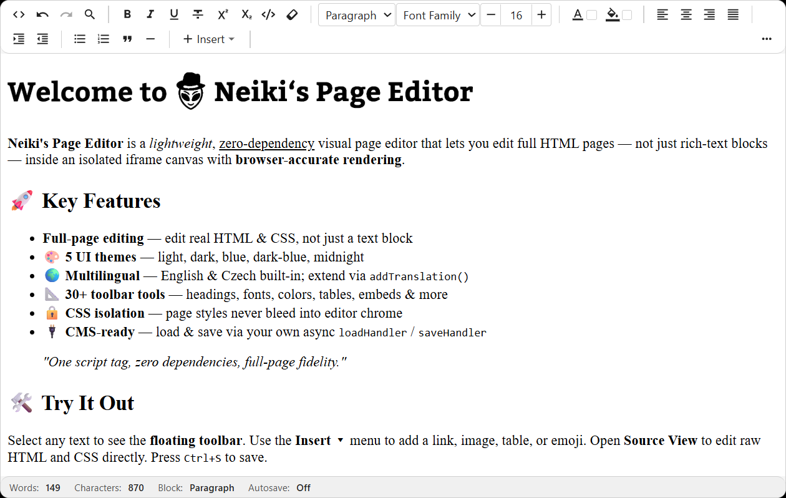

<p align="center">
  
</p>

<h1 align="center">Neiki's Page Editor</h1>

<p align="center">
  
  
  
  
  
  <br>
  
  
</p>

<p align="center">
  <b>Lightweight Visual Page / CMS Editor</b><br>
  <i>Full-page HTML &amp; CSS editing inside an isolated iframe canvas. Zero dependencies.</i>
</p>

<p align="center">
  
  
  
  
</p>

<p align="center">
  <a href="https://sourceforge.net/projects/neiki-page-editor/files/latest/download"></a>
</p>

---

<p align="center">
  
</p>

---

**Live version:** [https://neikiri.dev/page-editor](https://neikiri.dev/page-editor)

---

## Table of Contents

- [Overview](#overview)
- [Why Neiki's Page Editor?](#why-neikis-page-editor)
- [Features](#features)
- [Getting started](#getting-started)
- [Quick Start — CDN](#quick-start--cdn)
- [Quick Start — npm / ESM](#quick-start--npm--esm)
- [HTML/CSS Rendering Model](#htmlcss-rendering-model)
- [Options](#options)
- [Public API](#public-api)
- [Loading and Saving (Database Integration)](#loading-and-saving-database-integration)
- [Plugins](#plugins)
- [Localization (i18n)](#localization-i18n)
- [Themes](#themes)
- [Security and Sanitization](#security-and-sanitization)
- [Browser Support](#browser-support)
- [License](#license)

---

## Overview

Neiki's Page Editor is a visual page editor written in plain JavaScript with **zero dependencies**. You attach it to any `<div>` and it becomes a full editing surface — toolbar, formatting tools, tables, images, video, source view, and a status bar — all rendered inside an isolated `<iframe>` canvas so the page looks exactly as it would in a real browser tab.

```html
<div id="editor"></div>
<script src="https://cdn.neikiri.dev/neiki-page-editor/neiki-page-editor.min.js"></script>
<script>
  const editor = new NeikiPageEditor('#editor', {
    loadHandler: async () => ({ html: '<p>Start editing.</p>', css: '' }),
    saveHandler: async (payload) => console.log('Saved', payload),
  });
</script>
```

That snippet is a complete, working page editor. The minified build bundles its own CSS, so a single `<script>` tag is enough to get started. From there you can configure the toolbar, wire up load/save callbacks, switch themes, and extend behaviour through the plugin API.

---

## Why Neiki's Page Editor?

Most CMS editors ask you to make a trade-off: either render inside a plain `<div contenteditable>` and lose CSS fidelity, or build a full page-preview environment and take on a heavy dependency. Neiki's Page Editor avoids that trade-off.

- **One file, no dependencies.** The editor ships as a single script. The minified build embeds its CSS, so there is nothing else to install, import, or bundle. Drop it into a static page, a PHP template, or a SPA component — it behaves the same way.

- **Real CSS rendering, not a preview stub.** Page content lives inside a sandboxed `<iframe>` with `allow-same-origin`. Your actual page CSS renders with browser-accurate fidelity — fonts, layout, spacing, colours — all exactly as the end user will see them, while the editor chrome stays completely isolated.

- **Full-page editing, not just a body fragment.** You can load a complete HTML document — `<link>` stylesheets, `<style>` blocks, body content — and the editor extracts, sanitizes, and wires it all up correctly. Load, edit, and save entire pages through your own async handlers.

- **Zero-config by default, configurable when you need it.** `new NeikiPageEditor('#editor')` gives you the full toolbar immediately. Every option is optional, so you only reach for configuration when you actually want to change something.

- **Production editing features, not just bold and italic.** Image resize handles, table column resizing, a table context menu, drag-and-drop block reordering, a floating selection toolbar, find & replace with regex, an HTML + CSS source view, autosave, fullscreen, and print are all built in.

- **Built-in sanitization.** All HTML entering the editor is sanitized client-side through a DOMParser-based allowlist, and the bundled PHP helper exposes a server-side `sanitize()` method. Security is part of the editor, not an afterthought (see [Security and Sanitization](#security-and-sanitization)).

- **CSS isolation guaranteed.** Host page styles never bleed into the canvas. Canvas page styles never bleed into the editor chrome. The iframe sandbox enforces this at the browser level — no hacks, no specificity battles.

- **Extensible through a clean plugin API.** Custom toolbar buttons, commands, and translation keys can be registered without touching editor internals. A `destroy()` method makes clean teardown in SPA components straightforward.

If you want a page editor that renders real CSS, works from a single file, and integrates cleanly with any backend through load/save callbacks — that is the gap this project fills.

---

## Features

- **Accurate rendering** — page HTML and CSS render in an isolated iframe exactly as they would in a real browser tab.
- **CMS/database-ready** — pages are loaded and saved through developer-configured async callbacks; no backend is assumed.
- **One-script CDN usage** — a single `<script>` tag is all you need; no build step required for consumers.
- **Familiar toolbar UX** — layout and controls match Neiki's Editor exactly.
- **Full-page editing** — load a body fragment or an entire HTML document with `<style>` blocks and external stylesheets.
- **Zero runtime dependencies** — vanilla JavaScript only.
- **Seven built-in themes** — light, dark, blue, dark-blue, midnight, void, autumn.
- **Seven built-in languages** — English, Czech, Spanish, Simplified Chinese, German, French, Japanese — with an extensible i18n system.
- **PHP sanitization helper** — optional server-side complement for database persistence.

---

## Getting started

The recommended install is the single bundled script from the CDN. CSS is included automatically.

```html
<script src="https://cdn.neikiri.dev/neiki-page-editor/neiki-page-editor.min.js"></script>
```

<details>
<summary><b>Other installation options</b> (pinned version, separate CSS/JS, jsDelivr, npm, self-hosted)</summary>

<br>

**Pin a specific version**

```html
<script src="https://cdn.neikiri.dev/neiki-page-editor/0.3.0/neiki-page-editor.min.js"></script>
```

**Load CSS and JS separately**

```html
<!-- Latest -->
<link rel="stylesheet" href="https://cdn.neikiri.dev/neiki-page-editor/neiki-page-editor.css">
<script src="https://cdn.neikiri.dev/neiki-page-editor/neiki-page-editor.js"></script>

<!-- Or pinned -->
<link rel="stylesheet" href="https://cdn.neikiri.dev/neiki-page-editor/0.3.0/neiki-page-editor.css">
<script src="https://cdn.neikiri.dev/neiki-page-editor/0.3.0/neiki-page-editor.js"></script>
```

**Alternative CDN — jsDelivr**

```html
<script src="https://cdn.jsdelivr.net/gh/neikiri/neiki-page-editor@latest/dist/neiki-page-editor.min.js"></script>

<!-- Pinned -->
<script src="https://cdn.jsdelivr.net/gh/neikiri/neiki-page-editor@0.3.0/dist/neiki-page-editor.min.js"></script>
```

**Package manager**

```bash
npm install neiki-page-editor
# or
yarn add neiki-page-editor
# or
pnpm add neiki-page-editor
```

**Self-hosted**

```html
<script src="path/to/neiki-page-editor.min.js"></script>

<!-- Or separate files -->
<link rel="stylesheet" href="path/to/neiki-page-editor.css">
<script src="path/to/neiki-page-editor.js"></script>
```

</details>

> **Note:** When using separate CSS and JS files, load the CSS **before** the JS so the editor renders correctly during initialization.

---

## Quick Start — CDN


The minified CDN build embeds all editor CSS and exposes `window.NeikiPageEditor`.

```html
<!DOCTYPE html>
<html lang="en">
<head>
  <meta charset="UTF-8">
  <title>My CMS</title>
</head>
<body>
  <!-- Target element -->
  <div id="editor"></div>

  <!-- Single script — no extra CSS file needed -->
  <script src="dist/neiki-page-editor.min.js"></script>
  <script>
    const editor = new NeikiPageEditor('#editor', {
      loadHandler: async () => {
        const res = await fetch('/api/page/1');
        return res.json(); // { html, css }
      },
      saveHandler: async (payload) => {
        await fetch('/api/page/1', {
          method: 'PUT',
          headers: { 'Content-Type': 'application/json' },
          body: JSON.stringify(payload),
        });
      },
      onReady: (editor) => console.log('Editor ready'),
    });
  </script>
</body>
</html>
```

### Version-pinned CDN URL

When distributing over a CDN, pin to a specific version to avoid unexpected breaking changes:

```html
<script src="https://cdn.neikiri.dev/neiki-page-editor/0.3.0/neiki-page-editor.min.js"></script>
```

---

## Quick Start — npm / ESM

### Install

```bash
npm install neiki-page-editor
```

### ES Module usage

```js
import NeikiPageEditor from 'neiki-page-editor';
// If your bundler doesn't handle CSS imports, also import the CSS separately:
// import 'neiki-page-editor/css';

const editor = new NeikiPageEditor('#editor', {
  theme: 'dark',
  language: 'cs',
  loadHandler: async () => ({
    html: '<p>Hello <strong>world</strong></p>',
    css: 'body { font-family: sans-serif; }',
  }),
  saveHandler: async (payload) => {
    console.log('Saved:', payload);
  },
});
```

### CommonJS / require

```js
const { NeikiPageEditor } = require('neiki-page-editor');
```

### Separate CSS build

When using the ESM or CJS build without embedded CSS, load the standalone stylesheet:

```html
<link rel="stylesheet" href="node_modules/neiki-page-editor/dist/neiki-page-editor.css">
```

### package.json exports

```json
{
  "main":   "dist/neiki-page-editor.js",
  "module": "dist/neiki-page-editor.esm.js",
  "exports": {
    ".":    { "import": "./dist/neiki-page-editor.esm.js", "require": "./dist/neiki-page-editor.js" },
    "./css": "./dist/neiki-page-editor.css"
  },
  "files": ["dist/", "php/", "README.md"]
}
```

---

## HTML/CSS Rendering Model

Understanding how Neiki's Page Editor renders HTML and CSS is essential for accurate CMS integration.

### The iframe Canvas

The editor renders page content inside a sandboxed `<iframe>` element:

```html
<iframe sandbox="allow-same-origin"></iframe>
```

- `allow-same-origin` is set so the editor can access `contentDocument`, `contenteditable`, and the Selection API.
- `allow-scripts` is **intentionally omitted** — page JavaScript never executes inside the editor.

### iframe Document Structure

The iframe document is written using this template:

```html
<!DOCTYPE html>
<html>
<head>
  <meta charset="UTF-8">
  <base href="[assetsBaseUrl]">       <!-- only when assetsBaseUrl is provided -->
  <style id="npe-base"></style>       <!-- minimal editing reset -->
  <!-- validated <link> stylesheet URLs from cssUrls -->
  <style id="npe-page"></style>       <!-- page CSS string -->
  <!-- extracted safe <style> blocks from fullHtml -->
  <style id="npe-helper"></style>     <!-- non-invasive editing helpers -->
</head>
<body contenteditable="true" spellcheck="true">
  <!-- sanitized page HTML -->
</body>
</html>
```

### CSS Injection Order

CSS is injected in this deterministic order (must not be changed):

| Order | Source | Element |
|---|---|---|
| 1 | Minimal editing reset | `<style id="npe-base">` |
| 2 | Validated external stylesheets | `<link data-npe-external>` |
| 3 | Page CSS string | `<style id="npe-page">` |
| 4 | Extracted `<style>` blocks from `fullHtml` | `<style data-npe-extracted>` |
| 5 | Non-invasive editing helpers | `<style id="npe-helper">` |

This order ensures page-level CSS (3–4) can override framework/library CSS (2) while the editor's own minimal styles (1, 5) never conflict with page content.

### CSS Isolation Rules

- **Host → canvas**: Host page CSS **never** affects content inside the iframe canvas.
- **Canvas → host**: Page CSS loaded into the iframe **never** affects the editor toolbar, modals, or any `.npe-*` element in the host page.
- **Theme → canvas**: Editor theme CSS **never** forcibly overrides page layout, typography, colors, or component styles inside the iframe.

### Page Loading Flow

When you call `setPage({ html, css, cssUrls })` or the `loadHandler` returns a payload:

1. If `fullHtml` is provided, `FullHtmlParser` extracts:
   - `<body>` innerHTML → page HTML
   - `<head><style>` blocks → extracted style blocks
   - `<link rel="stylesheet">` hrefs (validated) → external CSS URLs
2. Page HTML is sanitized through the allowlist sanitizer.
3. External stylesheet URLs are validated (default: must be `https?://` and end in `.css`).
4. The iframe document is written with the template above.
5. CSS is injected through `StyleManager` in the correct order.
6. The `onReady` callback fires.

### Full HTML Document Loading

You can load an entire HTML document (not just a body fragment):

```js
const editor = new NeikiPageEditor('#editor', {
  loadHandler: async () => ({
    fullHtml: `<!DOCTYPE html>
<html>
<head>
  <link rel="stylesheet" href="https://cdn.neikiri.dev/neiki-page-editor/neiki-page-editor.css">
  <style>h1 { color: navy; }</style>
</head>
<body>
  <h1>Page Title</h1>
  <p>Content</p>
</body>
</html>`,
  }),
});
```

`FullHtmlParser` extracts the `<body>`, the `<style>` block, and the validated `<link>` URL automatically.

### Editor DOM Layout

```
target element (#editor)
└── .npe-editor
    ├── .npe-toolbar           ← toolbar (host document)
    ├── .npe-canvas-wrapper
    │   ├── iframe[sandbox="allow-same-origin"]
    │   │   └── html > body[contenteditable]  ← page content
    │   └── .npe-overlay-layer ← overlays (host document)
    └── .npe-statusbar
```

All `.npe-*` class names are prefixed to avoid conflicts with page content.

---

## Options

Pass options as the second argument to `new NeikiPageEditor(selector, options)`.

### Content options

| Option | Type | Default | Description |
|---|---|---|---|
| `initialContent` | `string` | `''` | HTML to load when no `loadHandler` is provided |
| `pageStyles` | `string` | `''` | CSS string to inject into the iframe on init |
| `cssUrls` | `string[]` | `[]` | Validated external stylesheet URLs to load |
| `assetsBaseUrl` | `string` | `''` | Base URL for relative asset paths inside the iframe |

### Layout options

| Option | Type | Default | Description |
|---|---|---|---|
| `minHeight` | `number` | `300` | Minimum canvas height in px |
| `maxHeight` | `number\|null` | `null` | Maximum canvas height in px (`null` = unlimited) |

### Editing options

| Option | Type | Default | Description |
|---|---|---|---|
| `autofocus` | `boolean` | `false` | Focus the canvas on init |
| `spellcheck` | `boolean` | `true` | Enable browser spellcheck in the canvas |
| `readonly` | `boolean` | `false` | Start in read-only mode |
| `editMode` | `'body'\|'regions'` | `'body'` | `'body'`: entire iframe body is editable. `'regions'`: only `[data-npe-editable]` elements are editable |
| `editableSelector` | `string` | `'[data-npe-editable]'` | CSS selector for editable regions (when `editMode: 'regions'`) |

### UI options

| Option | Type | Default | Description |
|---|---|---|---|
| `theme` | `string` | `'light'` | Initial theme: `'light'`, `'dark'`, `'blue'`, `'dark-blue'`, `'midnight'`, `'void'`, `'autumn'` |
| `persistTheme` | `boolean` | `false` | Persist theme choice in `localStorage` |
| `language` | `string` | `'en'` | UI language code: `'en'`, `'cs'`, or custom |
| `translations` | `object` | `{}` | Per-instance translation key overrides |
| `customClass` | `string\|null` | `null` | Extra CSS class added to the `.npe-editor` shell |
| `toolbar` | `string[]` | (default) | Override the toolbar items array |
| `showHelp` | `boolean` | `true` | Show help panel with keyboard shortcuts |

### Security options

| Option | Type | Default | Description |
|---|---|---|---|
| `allowDataUris` | `boolean` | `false` | Allow safe image/video `data:` URIs in content |
| `stylesheetUrlValidator` | `(url: string) => boolean` \| `null` | `null` | Custom validator for external stylesheet URLs |

### Upload handlers

| Option | Type | Default | Description |
|---|---|---|---|
| `imageUploadHandler` | `(file: File) => Promise<string>` \| `null` | `null` | Called with a `File`; resolves to a URL |
| `videoUploadHandler` | `(file: File) => Promise<string>` \| `null` | `null` | Called with a `File`; resolves to a URL |

### Backend callbacks

| Option | Type | Default | Description |
|---|---|---|---|
| `loadHandler` | `() => Promise<LoadPayload>` \| `null` | `null` | Async function to load page content |
| `saveHandler` | `(payload: SavePayload) => Promise<void>` \| `null` | `null` | Async function to persist content |

### Lifecycle callbacks

| Option | Type | Default | Description |
|---|---|---|---|
| `onReady` | `(editor) => void` | `null` | Fires once the editor and content are ready |
| `onChange` | `(html: string) => void` | `null` | Fires (debounced) when content changes |
| `onSave` | `(payload: SavePayload) => void` | `null` | Fires after a successful save |
| `onFocus` | `() => void` | `null` | Fires when the canvas receives focus |
| `onBlur` | `() => void` | `null` | Fires when the canvas loses focus |

### Autosave

| Option | Type | Default | Description |
|---|---|---|---|
| `autosaveKey` | `string\|null` | `null` | `localStorage` key prefix for autosave drafts. If `null`, the editor derives a key from the target element's `id` |

### Default toolbar

The default toolbar order (use `'|'` for separators):

```js
[
  'viewCode', 'undo', 'redo', 'findReplace', '|',
  'bold', 'italic', 'underline', 'strikethrough', 'superscript', 'subscript', 'code', 'removeFormat', '|',
  'heading', 'fontFamily', 'fontSize', '|',
  'foreColor', 'backColor', '|',
  'alignLeft', 'alignCenter', 'alignRight', 'alignJustify', '|',
  'indent', 'outdent', '|',
  'bulletList', 'numberedList', 'blockquote', 'horizontalRule', '|',
  'insertDropdown', '|',
  'moreMenu',
]
```

---

## Public API

### Instance Methods

#### Content

```js
editor.getContent()         // → string: sanitized HTML of canvas body
editor.setContent(html)     // set canvas HTML (sanitized before writing)
editor.getText()            // → string: plain text without HTML tags
editor.isEmpty()            // → boolean: true when canvas has no meaningful content
```

#### Page

```js
editor.getPage()            // → PagePayload: { html, css?, cssUrls?, assetsBaseUrl?, metadata? }
editor.setPage(payload)     // load a full page payload (HTML + CSS + cssUrls)
editor.getStyles()          // → string: current page CSS string
editor.setStyles(css)       // update page CSS (replaces current page CSS only)
```

#### Lifecycle

```js
editor.focus()              // move focus into the canvas
editor.blur()               // remove focus from the canvas
editor.enable()             // make the canvas editable
editor.disable()            // make the canvas read-only
editor.triggerSave()        // → Promise<void>: call saveHandler with current payload
editor.destroy()            // remove all DOM, listeners, and iframe references (idempotent)
```

#### UI

```js
editor.toggleFullscreen()   // toggle fullscreen mode on the editor shell
editor.setTheme(name)       // set theme: 'light' | 'dark' | 'blue' | 'dark-blue' | 'midnight' | 'void' | 'autumn'
editor.toggleTheme()        // cycle to the next theme
editor.getTheme()           // → string: current theme name
```

### Static Methods

```js
NeikiPageEditor.registerPlugin(plugin)         // register a plugin for all instances
NeikiPageEditor.getPlugins()                   // → Plugin[]: all registered plugins
NeikiPageEditor.addTranslation(lang, keys)     // add/extend a language translation map
```

### Payload Types

```ts
interface LoadPayload {
  html?: string                         // body HTML fragment
  fullHtml?: string                     // complete HTML document
  css?: string                          // page CSS string
  cssUrls?: string[]                    // validated external stylesheet URLs
  assetsBaseUrl?: string                // base URL for relative assets
  metadata?: Record<string, unknown>   // arbitrary metadata (passed through to getPage/save)
}

interface SavePayload {
  html: string                          // sanitized canvas HTML
  css?: string                          // current page CSS
  cssUrls?: string[]                    // current external stylesheet URLs
  assetsBaseUrl?: string                // current assetsBaseUrl
  metadata?: Record<string, unknown>   // metadata from last load
}

interface PagePayload {
  html: string
  css?: string
  cssUrls?: string[]
  assetsBaseUrl?: string
  metadata?: Record<string, unknown>
}
```

### Keyboard Shortcuts

| Shortcut | Action |
|---|---|
| `Ctrl+B` | Bold |
| `Ctrl+I` | Italic |
| `Ctrl+U` | Underline |
| `Ctrl+K` | Insert Link |
| `Ctrl+S` | Save |
| `Ctrl+Z` | Undo |
| `Ctrl+Y` / `Ctrl+Shift+Z` | Redo |
| `Tab` | Indent (list) / next editable region |
| `Shift+Tab` | Outdent (list) / previous editable region |

---

## Loading and Saving (Database Integration)

### Loading from a database

```js
const editor = new NeikiPageEditor('#editor', {
  loadHandler: async () => {
    const page = await myApi.getPage(pageId);
    return {
      html: page.content,
      css: page.styles,
      cssUrls: page.stylesheets,
      metadata: { pageId: page.id, version: page.version },
    };
  },
});
```

If `loadHandler` throws (e.g. network error), the editor falls back to `initialContent` or the target element's existing innerHTML.

### Saving to a database

```js
const editor = new NeikiPageEditor('#editor', {
  saveHandler: async (payload) => {
    await myApi.updatePage(pageId, {
      content: payload.html,
      styles: payload.css,
      stylesheets: payload.cssUrls,
    });
  },
  onSave: (payload) => showNotification('Saved!'),
});

// Programmatic save
document.querySelector('#save-btn').addEventListener('click', async () => {
  try {
    await editor.triggerSave();
  } catch (err) {
    // saveHandler threw — the editor already shows a toast
    console.error('Save failed:', err);
  }
});
```

### Loading a full HTML page

```js
const editor = new NeikiPageEditor('#editor', {
  loadHandler: async () => ({
    fullHtml: await fetchPageHtml(pageId),
    // fullHtml is parsed — body HTML, <style> blocks,
    // and <link rel="stylesheet"> hrefs are extracted automatically.
    metadata: { pageId },
  }),
});
```

### External stylesheets with custom validation

```js
const editor = new NeikiPageEditor('#editor', {
  cssUrls: ['https://cdn.neikiri.dev/neiki-page-editor/neiki-page-editor.css'],
  // Allow URLs from your CDN without requiring a .css extension
  stylesheetUrlValidator: (url) => url.startsWith('https://cdn.neikiri.dev/'),
  loadHandler: async () => ({ html: '<p>Content</p>' }),
});
```

### `editMode: 'regions'` for full pages

Use `'regions'` when the page contains fixed areas (navigation, footer) that should not be editable:

```html
<nav>Not editable</nav>
<main>
  <h1 data-npe-editable>Edit this heading</h1>
  <p data-npe-editable>Edit this paragraph</p>
</main>
<footer>Not editable</footer>
```

```js
const editor = new NeikiPageEditor('#editor', {
  editMode: 'regions',
  loadHandler: async () => ({ html: fullPageHtml }),
});
```

### Saving HTML with embedded CSS for download/preview

```js
const page = editor.getPage();
// page.html — sanitized body HTML
// page.css  — page CSS string

// Reconstruct a full document for storage:
const fullDoc = `<!DOCTYPE html>
<html><head>
  <meta charset="UTF-8">
  <style>${page.css || ''}</style>
</head><body>
  ${page.html}
</body></html>`;
```

---

## Plugins

Plugins extend the editor with custom toolbar buttons, commands, translations, and lifecycle hooks without modifying editor internals.

### Plugin interface

```ts
interface Plugin {
  id: string
  init(editor: NeikiPageEditor): void
  destroy?(): void
}
```

### Register a plugin

```js
NeikiPageEditor.registerPlugin({
  id: 'my-word-count',
  init(editor) {
    // Register a custom translation key
    NeikiPageEditor.addTranslation('en', {
      'toolbar.myWordCount': 'Word Count',
    });

    // Listen to content changes
    editor._editor.getBus().on('content:change', () => {
      const count = editor.getText().trim().split(/\s+/).filter(Boolean).length;
      console.log(`Words: ${count}`);
    });
  },
  destroy() {
    // Cleanup (called by destroy())
  },
});
```

### Add a custom toolbar button

```js
import { ToolbarBuilder } from 'neiki-page-editor/src/toolbar/ToolbarBuilder.js';

ToolbarBuilder.registerPluginButton({
  id: 'insertTimestamp',
  label: 'Insert Timestamp',
  icon: '🕐',
  toggle: false,
  action() {
    // Handled via toolbar:command event
  },
});

const editor = new NeikiPageEditor('#editor', {
  toolbar: ['bold', 'italic', '|', 'insertTimestamp'],
});

editor._editor.getBus().on('toolbar:command', (id) => {
  if (id === 'insertTimestamp') {
    const ts = new Date().toLocaleString();
    editor.setContent(editor.getContent() + `<p>${ts}</p>`);
  }
});
```

---

## Localization (i18n)

### Built-in languages

- `en` — English (default)
- `cs` — Czech

### Setting the language

```js
const editor = new NeikiPageEditor('#editor', { language: 'cs' });
```

### Per-instance translation overrides

```js
const editor = new NeikiPageEditor('#editor', {
  translations: {
    'toolbar.bold': 'BOLD',
    'menu.more.save': 'Publish',
  },
});
```

### Adding a new language

```js
NeikiPageEditor.addTranslation('it', {
  'toolbar.bold': 'Grassetto',
  'toolbar.italic': 'Corsivo',
  'toolbar.underline': 'Sottolineato',
  'menu.more.save': 'Salva',
  // ... all required keys
});

const editor = new NeikiPageEditor('#editor', { language: 'it' });
```

Translation lookup chain: **custom per-instance overrides → registered language → English → key itself**.

### Translation key reference

Keys follow the flat dot-separated style:

```
toolbar.bold          toolbar.italic         toolbar.underline
toolbar.heading       toolbar.fontFamily     toolbar.fontSize
toolbar.foreColor     toolbar.backColor
toolbar.insertDropdown                       toolbar.moreMenu
modal.link.title      modal.link.url         modal.link.text
modal.image.title     modal.video.title      modal.table.title
statusbar.words       statusbar.characters   statusbar.block
menu.more.save        menu.more.preview      menu.more.changeTheme
error.saveFailed      error.loadFailed       error.uploadFailed
```

---

## Themes

Seven built-in themes affect the editor chrome (toolbar, status bar, modals, dropdowns) only. Page content inside the iframe is **never** forcibly re-themed.

| Theme name | Description | CSS class on `.npe-editor` |
|---|---|---|
| `light` | Default light theme | _(none)_ |
| `dark` | Dark toolbar and chrome | `npe-dark` |
| `blue` | Blue accent toolbar | `npe-theme-blue` |
| `dark-blue` | Dark with blue accents | `npe-theme-dark-blue` |
| `midnight` | Deep dark theme | `npe-theme-midnight` |
| `void` | Dark purple cyberpunk theme with neon glow accents | `npe-theme-void` |
| `autumn` | Warm retro theme with a gruvbox-inspired palette | `npe-theme-autumn` |

### Switching themes programmatically

```js
editor.setTheme('dark');
editor.toggleTheme();    // cycles: light → dark → blue → dark-blue → midnight → void → autumn → light
editor.getTheme();       // → 'dark'
```

### Persisting theme preference

```js
const editor = new NeikiPageEditor('#editor', {
  persistTheme: true,   // saves theme to localStorage
  theme: 'dark',        // initial theme (overridden by localStorage if persistTheme is true)
});
```

### Custom theme CSS

Override theme CSS custom properties on `.npe-editor`:

```css
.npe-editor {
  --npe-color-bg: #1e1e1e;
  --npe-color-toolbar: #252526;
  --npe-color-text: #d4d4d4;
  --npe-color-accent: #0078d4;
  --npe-color-border: #3c3c3c;
}
```

---

## Security and Sanitization

### Client-side sanitizer

All HTML entering the editor through any path is sanitized by a DOMParser-based allowlist sanitizer before rendering:

- Allowed structural tags: `div`, `section`, `article`, `main`, `header`, `footer`, `nav`, `aside`, `figure`, `figcaption`, `p`, `h1`–`h6`, `blockquote`, `pre`, `hr`, `br`
- Allowed inline tags: `span`, `strong`, `em`, `u`, `s`, `sub`, `sup`, `code`, `a`
- Allowed media tags: `img`, `video`
- Allowed list tags: `ul`, `ol`, `li`
- Allowed table tags: `table`, `thead`, `tbody`, `tfoot`, `tr`, `th`, `td`

Blocked unconditionally:
- Executable tags: `script`, `iframe`, `object`, `embed`
- Form tags: `form`, `input`, `button`, `select`, `textarea`
- Metadata tags: `meta`, `base`, `link`, `style`
- All `on*` event attributes
- `javascript:` and `vbscript:` URLs
- `data:` URIs (by default)

### Allowing media data URIs

Data URIs are blocked by default. Enable them only for uploaded images/videos when no upload handler is available:

```js
const editor = new NeikiPageEditor('#editor', {
  allowDataUris: true,
});
```

Even with `allowDataUris: true`:
- Only `img[src]` and `video[src]` accept `data:` URIs.
- Allowed MIME types: `image/png`, `image/jpeg`, `image/gif`, `image/webp`, `image/avif`, `video/mp4`, `video/webm`.
- SVG data URIs (`image/svg+xml`) are **never** allowed.
- `data:` in `href`, `poster`, or any other attribute is always blocked.

### External stylesheet validation

External stylesheet URLs (from `cssUrls` or parsed from `fullHtml`) are validated before injection. Default validator requires:
- HTTP or HTTPS protocol
- Path ending in `.css`

Provide a custom validator for other URL patterns:

```js
const editor = new NeikiPageEditor('#editor', {
  stylesheetUrlValidator: (url) =>
    url.startsWith('https://assets.mycompany.com/'),
});
```

### Server-side sanitization (required)

The client-side sanitizer is a UX safeguard, not a security boundary. **Always sanitize HTML server-side before persisting to the database.**

The optional PHP helper provides a server-side complement:

```php
require_once 'vendor/neiki-page-editor/php/NeikiPageEditorSanitizer.php';

// In your save handler:
$safe = NeikiPageEditorSanitizer::sanitize($_POST['html']);
$db->updatePage($pageId, ['content' => $safe]);
```

The PHP sanitizer uses the same allowlist as the JavaScript sanitizer and requires no Composer dependencies — it uses PHP's built-in `DOMDocument`.

### CSP compatibility

The editor does not require `unsafe-eval` or `unsafe-inline` in the host page's Content-Security-Policy. Editor CSS is injected into the iframe document only. Inline styles on page content elements are page content, not editor infrastructure.

---

## Browser Support

| Browser | Support |
|---|---|
| Chrome (latest stable) | ✅ Full support |
| Firefox (latest stable) | ✅ Full support |
| Safari (latest stable) | ✅ Full support |
| Edge (latest stable) | ✅ Full support |
| Internet Explorer | ❌ Not supported |

The editor targets ES2017+ (`async/await`, `class`, `const/let`, template literals, `Map`, `Set`). No polyfills are bundled.

---

## Development

```bash
# Install dev dependencies
npm install

# Build all dist files
npm run build

# Run unit tests
npm test

# Run property-based tests
npm run test:property

# Run integration tests
npm run test:integration

# Run all tests
npm run test:all
```

### Build outputs

| File | Size (gzip) | Purpose |
|---|---|---|
| `dist/neiki-page-editor.min.js` | ~165 KB raw | CDN build; embeds CSS; exposes `window.NeikiPageEditor` |
| `dist/neiki-page-editor.js` | ~271 KB raw | Unminified UMD build |
| `dist/neiki-page-editor.esm.js` | ~270 KB raw | ES module for bundlers |
| `dist/neiki-page-editor.css` | ~34 KB raw | Standalone editor CSS |

---

## License

[Source Available](LICENSE) — see the LICENSE file for terms.

This project uses a custom source-available license. The source code is publicly visible for reference and non-commercial use. Commercial use, redistribution, or incorporation into a product requires a separate commercial license. Contact [neikiri.dev](https://neikiri.dev) for details.
